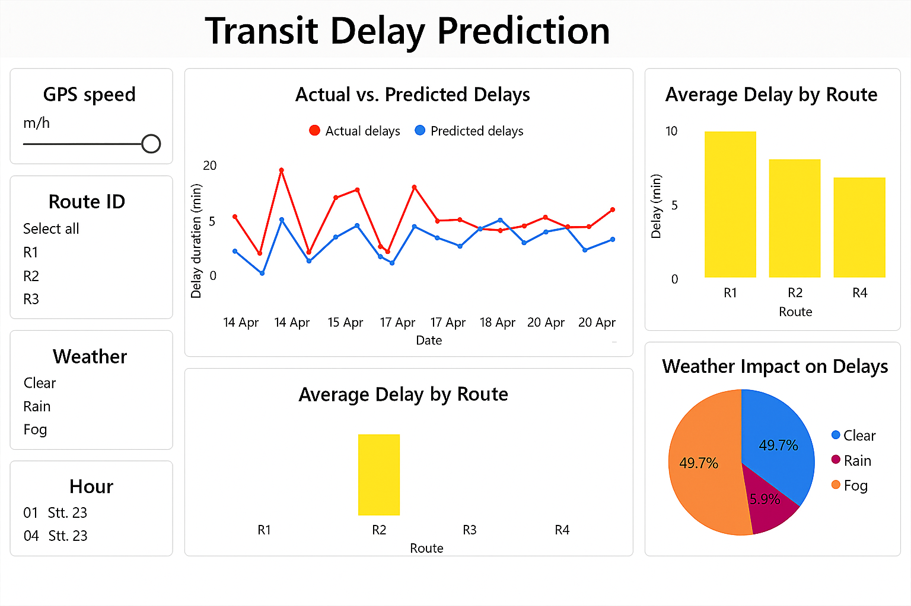

# Transit Delay Prediction 
A machine learning system to predict delays in public transit based on real-time GPS, weather, and route data. Designed for intelligent transport operations.

---
##  Power BI Dashboard

This dashboard visualizes delay predictions and their relationships to GPS speed, route ID, and weather conditions.



##  Features
- Predicts delays using historical and real-time features (route ID, GPS, weather)
- Deployed on **AWS Lambda** using **Docker**
- Visualized in **Power BI** for operational monitoring
- Integrated with **SHAP** for model explainability

---

##  Tech Stack
- **Python**, **Pandas**, **Scikit-learn**
- **AWS Lambda**, **Docker**
- **Power BI**
- **SHAP**

---

##  Use Case
Designed for transit authorities to predict vehicle delays and proactively inform routing and operations teams.

---

##  SHAP Summary Plot

This plot shows which features most influence the model’s delay predictions:


> 🔵 Blue = Low feature value  🔴 Red = High feature value  
The horizontal axis shows the impact of a feature on the prediction (delay or not).  
The vertical axis lists the most important features:
- **gps_speed**: Speed of the vehicle in km/h
- **route_id**: Transit route number
- **weather_code**: Weather condition (0: Clear, 1: Rain, 2: Snow, 3: Fog)
- **hour**: Hour of the day (from timestamp)

---

##  Setup Instructions

### 1. Clone the repository
```bash
git clone https://github.com/your_username/transit-delay-prediction.git
cd transit-delay-prediction
